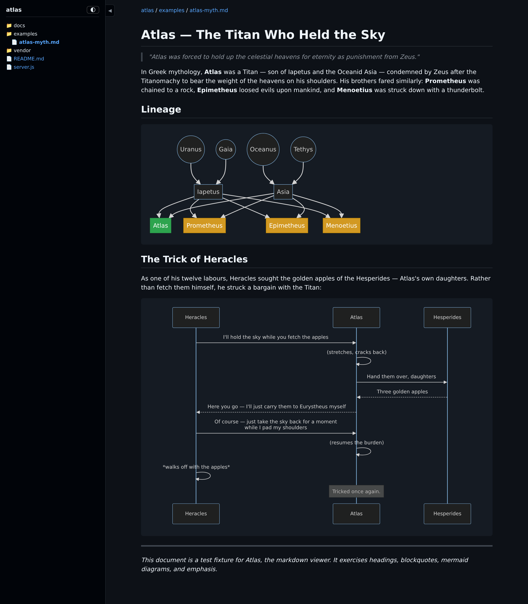

# Atlas

A lightweight document and code viewer with markdown rendering, mermaid diagrams, syntax highlighting, and file-tree navigation. No install step — the server uses only Node.js built-ins, and all client-side libraries are vendored in `vendor/`.



## Features

- **Markdown rendering** — reads `.md` files on each request, no build step
- **Code file viewing** — syntax-highlighted rendering for 30+ languages
- **Image view + download** — dedicated view page with filename, size, and Download button for `.png/.jpg/.jpeg/.gif/.webp/.svg/.bmp/.ico/.avif`
- **Mermaid diagrams** — flowcharts, sequence diagrams, state diagrams, etc.
- **File-tree sidebar** — collapsible, auto-expands to current page
- **Light/dark mode** — toggle with persistence
- **Directory browsing** — navigate folders with icon-based listing
- **GitHub-style theming** — familiar appearance
- **UTF-8 safe** — proper handling of multi-byte characters

## Image URLs

For any image file, three access modes are available:

| URL | Response |
|---|---|
| `/path/to/image.png` | HTML wrapper page (browser navigation) OR raw bytes (markdown `` embeds, curl) — decided by `Accept` header |
| `/path/to/image.png?raw=1` | Raw bytes, regardless of `Accept` |
| `/path/to/image.png?download=1` | Raw bytes with `Content-Disposition: attachment` |

Markdown-embedded images (`` inside `.md` files) continue to render inline — the raw bytes are served when the request `Accept` header isn't `text/html`.

## Quick Start

```bash
node server.js /path/to/your/docs
```

Opens on `http://localhost:8881`.

## Configuration

All configuration is via environment variables:

```bash
PORT=9090 ADDRESS=0.0.0.0 node server.js /path/to/your/docs
```

| Variable | Default | Description |
|---|---|---|
| `PORT` | `8881` | HTTP port |
| `ADDRESS` | `127.0.0.1` | Bind address |

## Architecture

- **Server:** Single-file `server.js` using only Node built-ins (`node:http`, `node:fs/promises`, `node:path`, `node:zlib`, `node:crypto`). No `package.json`, no `npm install`, no `node_modules`.
- **Client rendering:** Client-side via [marked](https://github.com/markedjs/marked), [mermaid](https://github.com/mermaid-js/mermaid), and [highlight.js](https://github.com/highlightjs/highlight.js), with [github-markdown-css](https://github.com/sindresorhus/github-markdown-css) for styling. These libraries are **vendored** — checked into `vendor/` — so nothing is fetched at runtime or build time.

The server reads files on each request and serves them inside an HTML template. All rendering happens in the browser — no intermediate format, no build step. The file tree sidebar is built server-side and cached for 30 seconds.

### A note on dependencies

Atlas has **no runtime package manager dependencies** (nothing to `npm install`), but it is **not dependency-free**. The client-side libraries in `vendor/` are third-party code — they carry their own licences (marked, mermaid, highlight.js, github-markdown-css) and must be updated manually when you want newer versions. The tradeoff is intentional: you clone the repo and run `node server.js` — no install, no network fetches, no lockfile drift.
