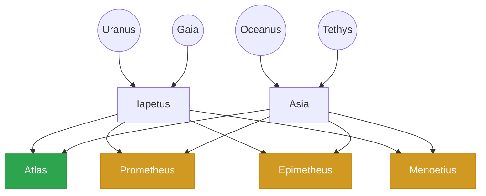
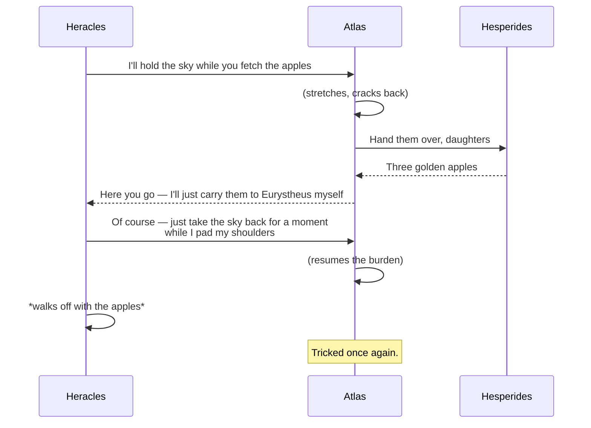

# Atlas — The Titan Who Held the Sky

> *"Atlas was forced to hold up the celestial heavens for eternity as punishment from Zeus."*

In Greek mythology, **Atlas** was a Titan — son of Iapetus and the Oceanid Asia — condemned by Zeus after the Titanomachy to bear the weight of the heavens on his shoulders. His brothers fared similarly: **Prometheus** was chained to a rock, **Epimetheus** loosed evils upon mankind, and **Menoetius** was struck down with a thunderbolt.

## Lineage

## The Trick of Heracles

As one of his twelve labours, Heracles sought the golden apples of the Hesperides — Atlas's own daughters. Rather than fetch them himself, he struck a bargain with the Titan:

---

*This document is a test fixture for Atlas, the markdown viewer. It exercises headings, blockquotes, mermaid diagrams, and emphasis.*
